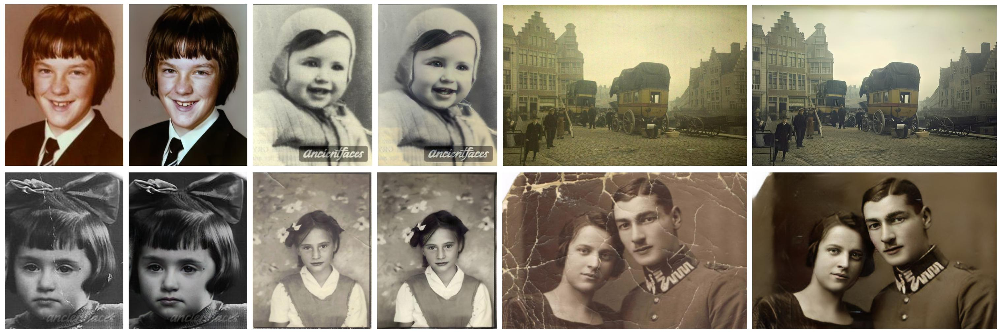
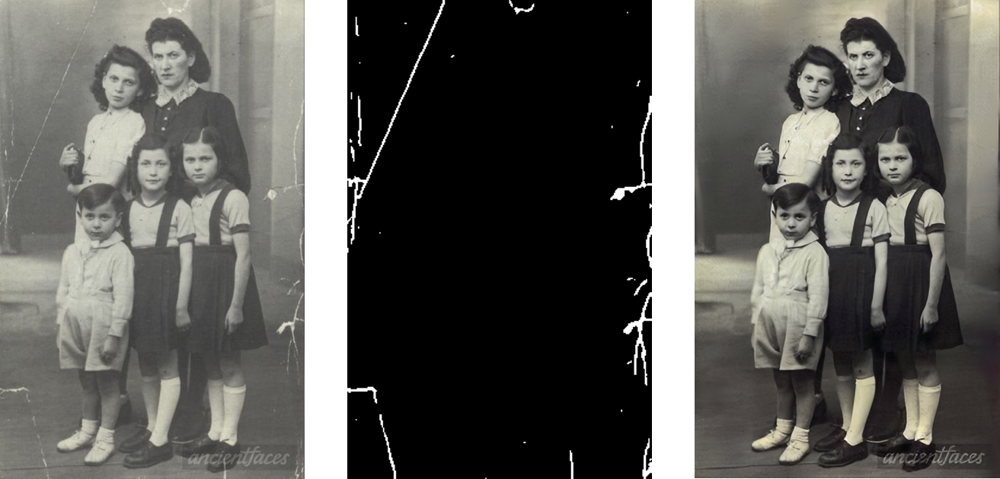
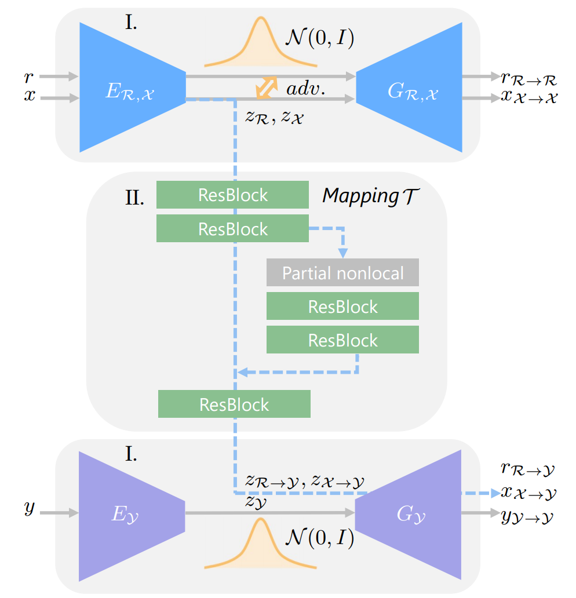
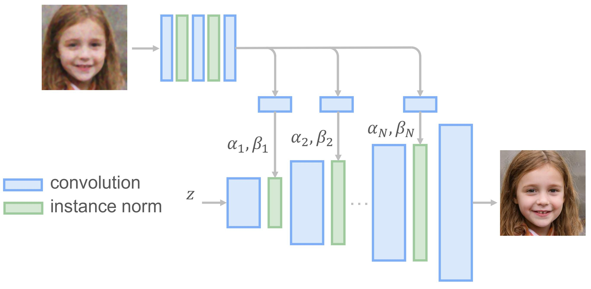
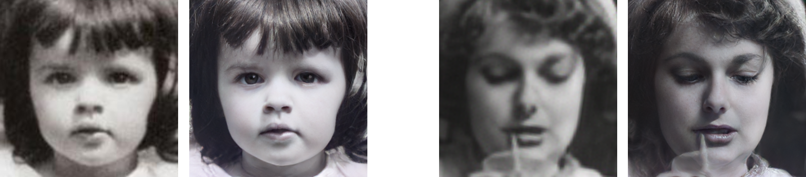

# Old Photo Restoration (Official PyTorch Implementation)



### [Project Page](http://raywzy.com/Old_Photo/) | [Paper (CVPR version)](https://arxiv.org/abs/2004.09484) | [Paper (Journal version)](https://arxiv.org/pdf/2009.07047v1.pdf) | [Pretrained Model](https://portland-my.sharepoint.com/:f:/g/personal/ziyuwan2-c_ad_cityu_edu_hk/Eh1gtjfLiWtLiBDGZhaTvokBvDUdvA5j49f_NpL_Pp9FPA?e=7EddTf) | [Colab Demo](https://colab.research.google.com/drive/1NEm6AsybIiC5TwTU_4DqDkQO0nFRB-uA?usp=sharing) :fire:

**Bringing Old Photos Back to Life, CVPR2020 (Oral)**

**Old Photo Restoration via Deep Latent Space Translation, PAMI Under Review**

[Ziyu Wan](http://raywzy.com/)<sup>1</sup>,
[Bo Zhang](https://www.microsoft.com/en-us/research/people/zhanbo/)<sup>2</sup>,
[Dongdong Chen](http://www.dongdongchen.bid/)<sup>3</sup>,
[Pan Zhang](https://panzhang0212.github.io/)<sup>4</sup>,
[Dong Chen](https://www.microsoft.com/en-us/research/people/doch/)<sup>2</sup>,
[Jing Liao](https://liaojing.github.io/html/)<sup>1</sup>,
[Fang Wen](https://www.microsoft.com/en-us/research/people/fangwen/)<sup>2</sup> <br>
<sup>1</sup>City University of Hong Kong, <sup>2</sup>Microsoft Research Asia, <sup>3</sup>Microsoft Cloud AI, <sup>4</sup>USTC

## New
You can now play with our [Colab](https://colab.research.google.com/drive/1NEm6AsybIiC5TwTU_4DqDkQO0nFRB-uA?usp=sharing) and try it on your photos. 

## Requirement
The code is tested on Ubuntu with Nvidia GPUs and CUDA installed. Python>=3.6 is required to run the code.

## Installation

Clone the Synchronized-BatchNorm-PyTorch repository for

```
cd Face_Enhancement/models/networks/
git clone https://github.com/vacancy/Synchronized-BatchNorm-PyTorch
cp -rf Synchronized-BatchNorm-PyTorch/sync_batchnorm .
cd ../../../
```

```
cd Global/detection_models
git clone https://github.com/vacancy/Synchronized-BatchNorm-PyTorch
cp -rf Synchronized-BatchNorm-PyTorch/sync_batchnorm .
cd ../../
```

Download the landmark detection pretrained model

```
cd Face_Detection/
wget http://dlib.net/files/shape_predictor_68_face_landmarks.dat.bz2
bzip2 -d shape_predictor_68_face_landmarks.dat.bz2
cd ../
```

Download the pretrained model from Azure Blob Storage, put the file `Face_Enhancement/checkpoints.zip` under `./Face_Enhancement`, and put the file `Global/checkpoints.zip` under `./Global`. Then unzip them respectively.

```
cd Face_Enhancement/
wget https://facevc.blob.core.windows.net/zhanbo/old_photo/pretrain/Face_Enhancement/checkpoints.zip
unzip checkpoints.zip
cd ../
cd Global/
wget https://facevc.blob.core.windows.net/zhanbo/old_photo/pretrain/Global/checkpoints.zip
unzip checkpoints.zip
cd ../
```

Install dependencies:

```bash
pip install -r requirements.txt
```

## How to use?

**Note**:GPU can be set 0 or 0,1,2 or 0,2; use -1 for CPU

### 1) Full Pipeline

You could easily restore the old photos with one simple command after installation and downloading the pretrained model.

For images without scratches:

```
python run.py --input_folder [test_image_folder_path] \
              --output_folder [output_path] \
              --GPU 0
```

For scratched images:

```
python run.py --input_folder [test_image_folder_path] \
              --output_folder [output_path] \
              --GPU 0 \
              --with_scratch
```

Note: Please try to use the absolute path. The final results will be saved in `./output_path/final_output/`. You could also check the produced results of different steps in `output_path`.

### 2) Scratch Detection

Currently we don't plan to release the scratched old photos dataset with labels directly. If you want to get the paired data, you could use our pretrained model to test the collected images to obtain the labels.

```
cd Global/
python detection.py --test_path [test_image_folder_path] \
                    --output_dir [output_path] \
                    --input_size [resize_256|full_size|scale_256]
```



### 3) Global Restoration

A triplet domain translation network is proposed to solve both structured degradation and unstructured degradation of old photos.

<p align="center">

</p>

```
cd Global/
python test.py --Scratch_and_Quality_restore \
               --test_input [test_image_folder_path] \
               --test_mask [corresponding mask] \
               --outputs_dir [output_path]

python test.py --Quality_restore \
 --test_input [test_image_folder_path] \
 --outputs_dir [output_path]
```


### 4) Face Enhancement

We use a progressive generator to refine the face regions of old photos. More details could be found in our journal submission and `./Face_Enhancement` folder.

<p align="center">

</p>




> *NOTE*: 
> This repo is mainly for research purpose and we have not yet optimized the running performance. 
> 
> Since the model is pretrained with 256*256 images, the model may not work ideally for arbitrary resolution.

## To Do
- [x] Clean testing code
- [x] Release pretrained model
- [x] Collab demo
- [ ] Replace face detection module (dlib) with RetinaFace
- [ ] Release training code


## Citation

If you find our work useful for your research, please consider citing the following papers :)

```
@inproceedings{wan2020bringing,
title={Bringing Old Photos Back to Life},
author={Wan, Ziyu and Zhang, Bo and Chen, Dongdong and Zhang, Pan and Chen, Dong and Liao, Jing and Wen, Fang},
booktitle={Proceedings of the IEEE/CVF Conference on Computer Vision and Pattern Recognition},
pages={2747--2757},
year={2020}
}
```

```
@misc{2009.07047,
Author = {Ziyu Wan and Bo Zhang and Dongdong Chen and Pan Zhang and Dong Chen and Jing Liao and Fang Wen},
Title = {Old Photo Restoration via Deep Latent Space Translation},
Year = {2020},
Eprint = {arXiv:2009.07047},
}
```

If you are also interested in the legacy photo/video colorization, please refer to [this work](https://github.com/zhangmozhe/video-colorization).


## Maintenance

This project is currently maintained by Ziyu Wan and is for academic research use only. If you have any questions, feel free to contact raywzy@gmail.com.

## License

The codes and the pretrained model in this repository are under the MIT license as specified by the LICENSE file. We use our labeled dataset to train the scratch detection model.

This project has adopted the [Microsoft Open Source Code of Conduct](https://opensource.microsoft.com/codeofconduct/). For more information see the [Code of Conduct FAQ](https://opensource.microsoft.com/codeofconduct/faq/) or contact [opencode@microsoft.com](mailto:opencode@microsoft.com) with any additional questions or comments.
